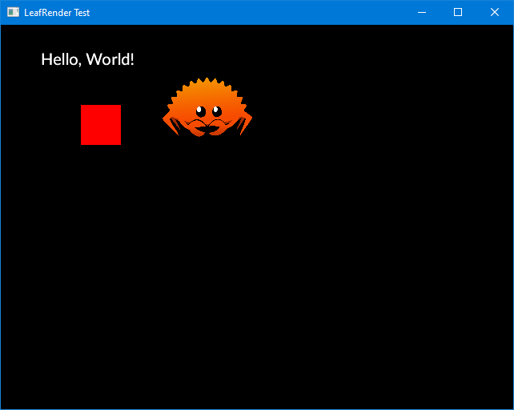

LeafRender
==========

LeafRender is a simply, easy to use library to just get pixels onto the screen, regardless of your platform.

Supported on Windows, Linux and the Raspberry Pi.

Other libraries often require huge amounts of bootstrap which simply doesn't make sense for WIP or hobby projects.

Some support is also included for image formats and input.



## Basic usage

Import the crate in your Cargo.toml with (assuming Windows/Linux OpenGL):

```toml
leafrender = "0.1.0"
```

In your code, have something like:

```rust
use leafrender::input::Input;
use leafrender::render::Drawer;
use leafrender::pos::Rect;
use leafrender::render::Color;
use leafrender::PlatformDrawer;
use leafrender::PlatformInput;

let mut drawer = PlatformDrawer::new("LeafRender Test", 640, 480)
       .expect("Failed to create drawer");
let mut input = PlatformInput::new();

while {
   input.update(&mut drawer);
       input.do_continue()
} {
    drawer.start();
    drawer.clear(false);
    drawer.enable_blending(); // Enable partial transparency.
                              // Left disabled by default for e.g. Pi

    drawer.draw_colored_rect(
        &Rect {
            x: 100,
            y: 100,
            width: 50,
            height: 50,
        },
        &Color {
            r: 255,
            g: 0,
            b: 0,
            a: 255,
        }
    );

    drawer.end();
}
```

## More examples

Want some text?

```rust
use crate::render::font::FontCache;
use crate::pos::Position;

let mut font = FontCache::from_bytes(include_bytes!("Lato-Regular.ttf"))
                .expect("Unable to load font");

// [...]
// Inside your main loop, ensuring that blending is enabled (simple example above):

font.draw(
   "Hello, World!",
   &Color {
       r: 0,
       g: 0,
       b: 0,
       a: 255,
   },
   12,
   &Position {
       x: 50,
       y: 50,
   },
   &mut drawer
;
```

Or an image?

```rust
use image; // image crate

let image = image::load_from_memory(include_bytes!("img.jpg"))
                .expect("Failed to load image")
                .to_rgba();
let image = drawer.convert_image(&image);

// [...]
// Inside your main loop, ensuring that blending is enabled (simple example above):

drawer.draw_texture(&image, &Position {
    x: 150,
    y: 150,
});
```

# Features

- Drawing of rectangles, vertices w/ colors
- Drawing of fonts using `rusttype`
- Drawing of images using `image`
- Basic input handling (mouse)

# Wishlist

- More complete input handling (keyboard)
- Clean up a few error handling edge cases
- Few bits of safety could be cleaned up

# Non-features

- 3D (too much to control here)
- Custom shaders

# License

LeafRender is licensed under the Apache 2.0 license, available [here](LICENSE).
